

# MPLAB® Harmony 3 Standalone IEEE 802.15.4 Physical Layer

MPLAB® Harmony 3 is an extension of the MPLAB® ecosystem for creating embedded firmware solutions for Microchip 32-bit SAM and PIC® microcontroller and microprocessor devices.  Refer to the following links for more information.

- [Microchip 32-bit MCUs](https://www.microchip.com/design-centers/32-bit)
- [Microchip 32-bit MPUs](https://www.microchip.com/design-centers/32-bit-mpus)
- [Microchip MPLAB X IDE](https://www.microchip.com/mplab/mplab-x-ide)
- [Microchip MPLAB® Harmony](https://www.microchip.com/mplab/mplab-harmony)
- [Microchip MPLAB® Harmony Pages](https://microchip-mplab-harmony.github.io/)

This repository contains the MPLAB® Harmony 3 Module for Standalone IEEE 802.15.4 Physical Layer that provide an interface to the microcontrollers (like SAML21, SAMD21) to access the transceiver functionality of radio transceivers like AT86RF233 or AT86RF212B. 
With the help of PHY layer module user can enable various functionaities of the transceiver.
reference information.

- [MPLAB® Harmony License](mplab_harmony_license.md)

# Contents Summary

| Folder     | Description                                                       |
| -----------| ------------------------------------------------------------------|
| config     | Standalone IEEE 802.15.4 Physical Layer module |
| docs|         [User guide](./README.md)
| drivers    | phy layer files     |

- Clone the [Standalone PHY](https://github.com/MicrochipTech/wireless_15_4_phy_trx) repo to user's local Harmony Repo.
- Refer to the section 2.5, Creating a New MCC Harmony Project in the [PIC32CXBZ2 Application Developer's Guide](https://onlinedocs.microchip.com/g/GUID-A5330D3A-9F51-4A26-B71D-8503A493DF9C).
- Project Graph appears with some predefined component as shown in image below:

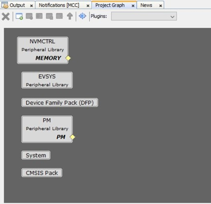

- The IEEE 802.15.4 PHY component will appear under Wireless->Drivers->IEEE 802.15.4 in the Device Resources tab as shown in image below:

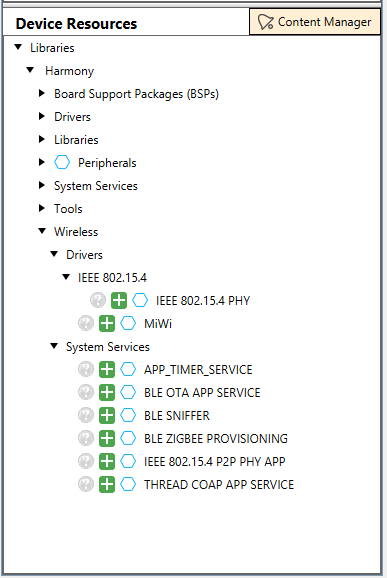

- Select MiWi (if MiWi protocol is used as higher layer) under “Wireless->Drivers” tab. Accept all Dependencies or satisfiers, by selecting "Yes". All the necessary components will be auto populated.
- Please follow the steps in the following [link](https://github.com/MicrochipTech/MiWi/blob/main/docs/GUID-32628D58-8B41-490F-8DA4-520C34856980.md) to configure for MiWi.

- Connect SERCOM5 and TC0 dependencies as shown in the image below:

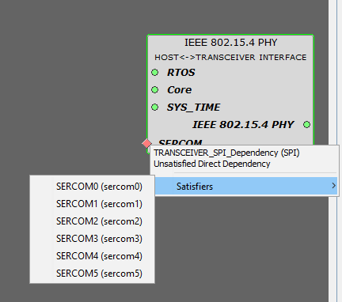

- Finally ensure that the project graph has all the components as depicted below.

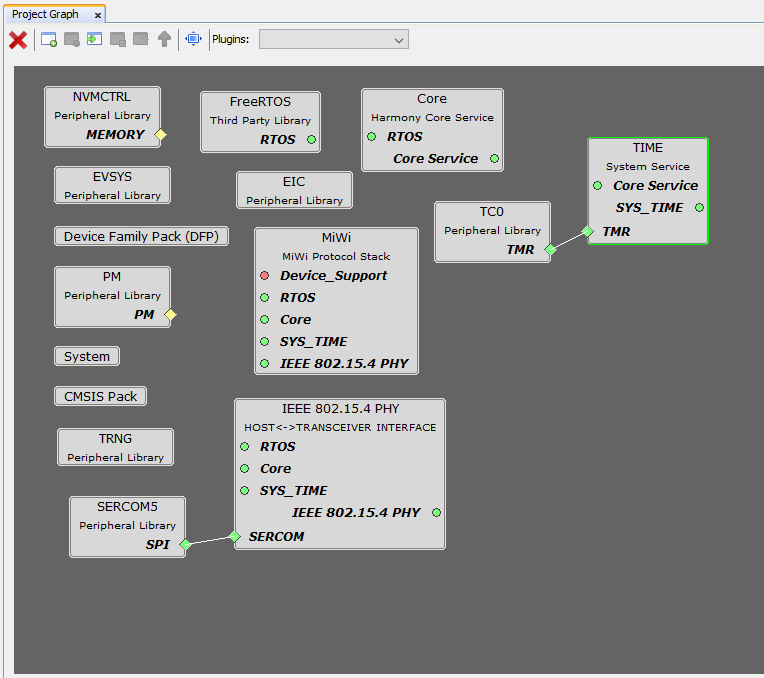

- Please follow the below steps for the “Configuration Options” changes to be done for Standalone PHY layer.
- Go to Plugins>Pin Configuration. Refer below image for the Pin configurations. Provide the same “Custom Name”, “Function” and “Direction” as depicted in image below.

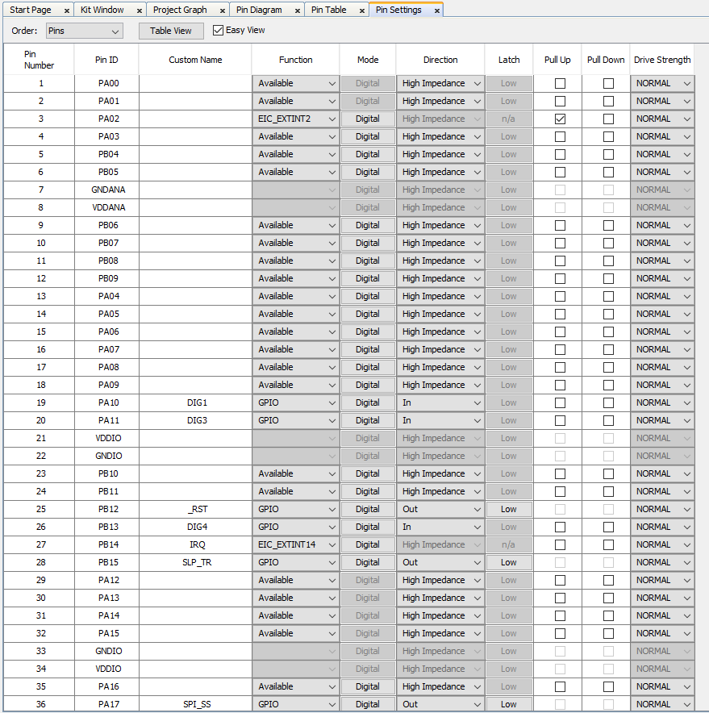

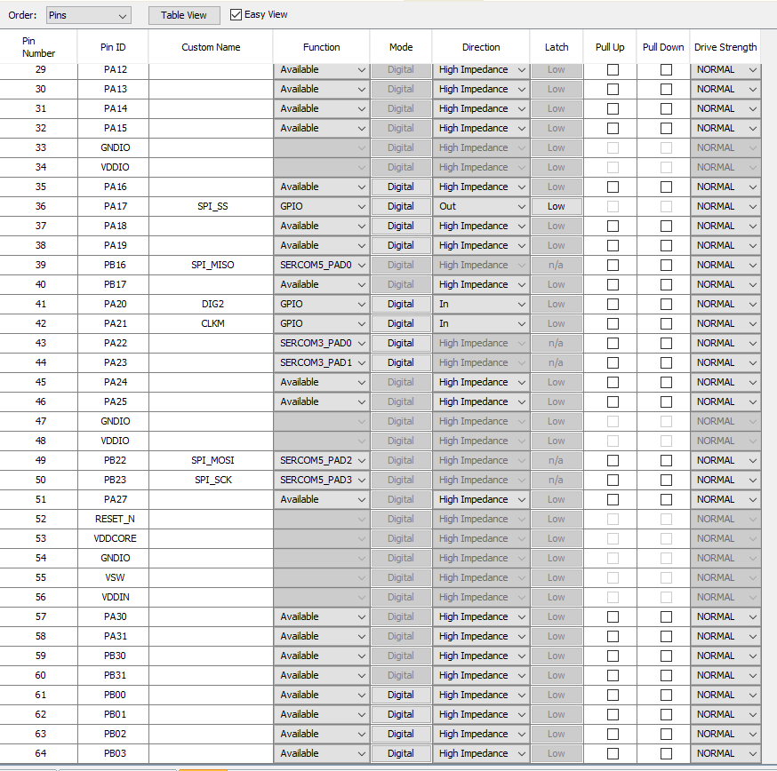

- The “Module Pin Selections” in the “Configuration Options” gets automatically populated when the correct pin configurations are configured.
- The Radio transceiver type can be changed by selecting the dropdown option availabel in “Select Transceiver Type”. At present only RF233 ans RF212B is supported.

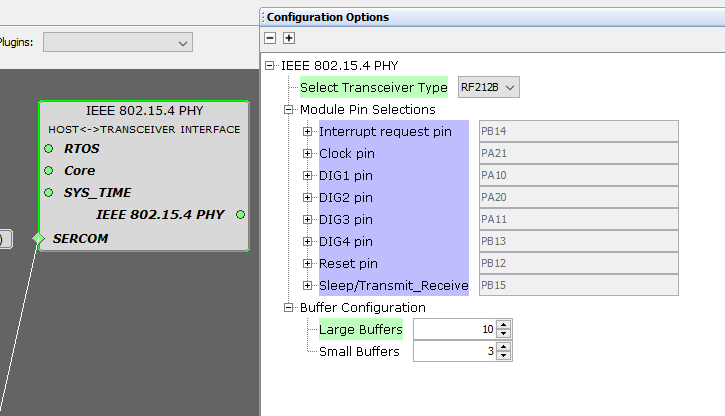

- Following are the EIC and Sercom5 configuration.

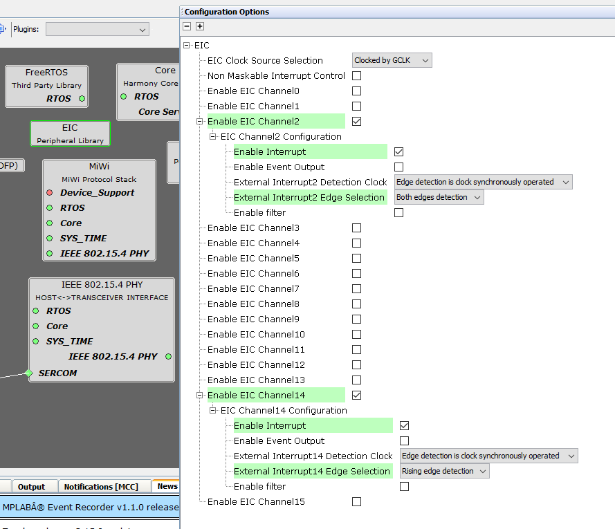

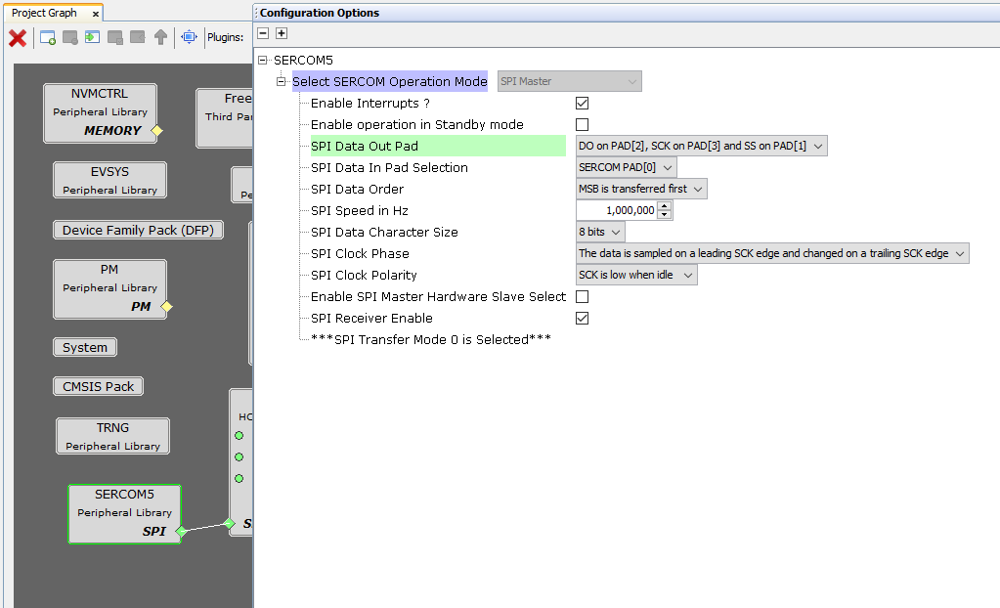

- Click on “Resource Management [MCC]” and click “Generate”.

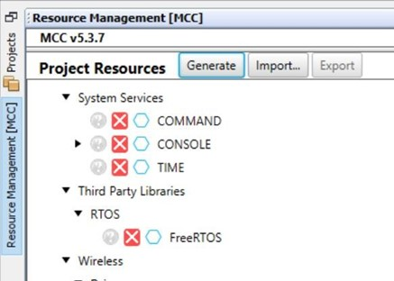

Note 1: After generating the code via MCC, make sure to implement the following changes. Right click on the project and go to properties. Select xc32-gcc. Under the option categories, select Preprocessing and Messages. 
Double click on the Preprocessor macros and add the symbol, PHY_AT86RF212B/PHY_AT86RF233 depending on the preference. Remove ENABLE_NETWORK_FREEZER & Chimera_SOC symbol if MiWi is used.

Note 2: To optimise the NVIC priority levels of different peripherals used such as EIC, SPI and TC, go to project source files>config>default>peripheral>plib_nvic.c, change the NVIC priority as shown in the image below:

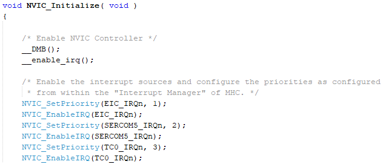

Note 3: In app.c file replace "appData.appQueue = xQueueCreate( 64, sizeof(APP_Msg_T) );" with "appData.appQueue = xQueueCreate( 5, sizeof(APP_Msg_T) );"

Note 4: The following applies if MiWi protocol is used as higher layer : In the file tasks.c replace "#define TASK_MIWI_STACK_SIZE (8 *1024 / sizeof(portSTACK_TYPE))" with "#define TASK_MIWI_STACK_SIZE (2 *1024 / sizeof(portSTACK_TYPE))"

Note 5: The size of lAPP_Tasks should be changed to 512 in task.c file. 

